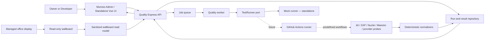
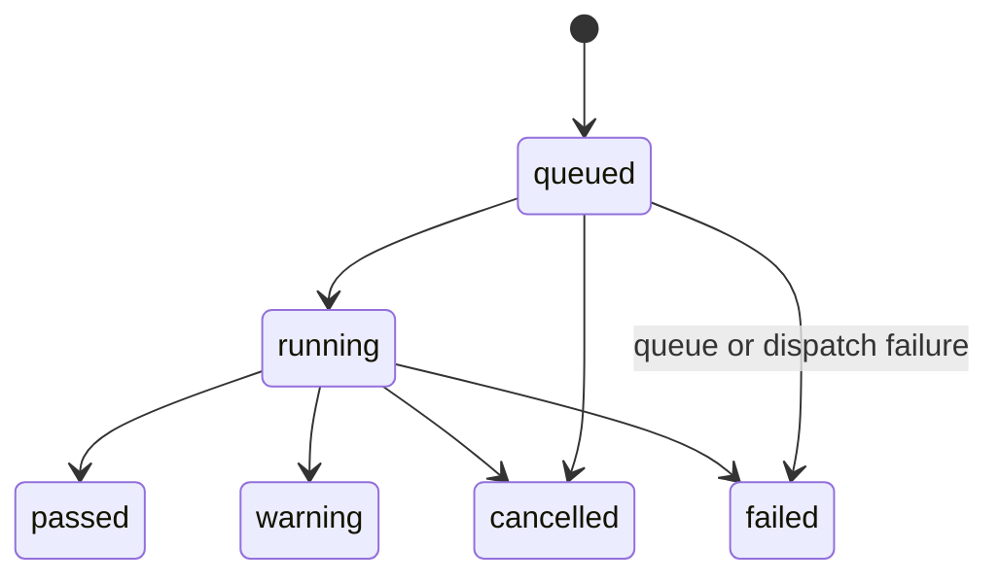

# Mumsio Quality & Testing Center — Architecture

Status: **Implemented for the standalone mock MVP; live integration pending**

Scope: standalone build first; Mumsio integration later

Last updated: 2026-08-17

## 1. Executive decision

Build the Quality Center as a **TypeScript modular monolith in a workspace monorepo**, with a Vue application, an Express API, pure shared domain packages, and replaceable adapters. The final user experience has two modes backed by the same domain and API:

- an interactive Mumsio Admin workspace for authorized Owners and Developers;
- a secure, sanitized, read-only wallboard for a large office display.

The Quality Center is a control plane. It starts approved tests, tracks execution, normalizes provider output, applies deterministic policy and scoring, and presents results. It is not a replacement for k6, GitHub Actions, OWASP ZAP, Nuclei, Railway, Supabase, Cloudflare, Expo/EAS, Maestro, Stripe, or Telnyx.

The first build uses deterministic fixtures, an in-memory repository, an in-process queue, and a mock runner. Production integration later replaces those adapters with Supabase, Railway Redis/BullMQ, and GitHub Actions while preserving the domain, API contracts, and UI.

This balances four goals:

- isolation from active Mumsio development;
- easy future import into the existing Vue/Express application;
- server-enforced safety for privileged test execution;
- low operational complexity and no unnecessary microservices.

## 2. Scope and non-goals

### In scope

- system health dashboard and quality dimensions;
- embedded Mumsio Admin navigation for Owner/Developer access;
- a 16:9 office wallboard with automatic refresh and explicit stale-data handling;
- predefined test catalog and controlled execution;
- run status, history, details, security findings, and release comparison;
- deterministic normalization and scoring;
- mock Owner and Developer authorization;
- server-side environment and concurrency policy;
- ports for storage, queueing, runners, authorization, audit, and optional AI explanation;
- documented future connectors.

### Not in scope for the standalone phase

- live Mumsio authentication or authorization;
- production credentials or service tokens;
- live Supabase migrations;
- running k6, ZAP, Nuclei, EAS, or Maestro;
- sending Stripe payments or Telnyx messages/calls;
- arbitrary commands, URLs, durations, virtual-user counts, or scripts;
- replacing provider-native monitoring or observability;
- AI-controlled pass/fail or AI-generated health scores.

## 3. System context



The browser never receives provider secrets and never dispatches a runner directly. Every command crosses the Express authorization and safety boundary. The office display receives a separate read-only projection and has no route to command handlers.

## 4. Runtime architecture

### Standalone phase

```text
Vue web
   │ HTTP polling
Express API
   ├── application services
   ├── domain policies and scoring
   ├── InMemoryJobQueue
   ├── MockTestRunner
   └── InMemory repositories
```

This mode is deterministic and requires no external accounts. In-memory data loss after restart is an accepted standalone limitation.

### Integrated production target

```text
Cloudflare
   │
Mumsio Vue Admin
   │ existing authenticated session
Mumsio Express API on Railway
   ├── Supabase repositories
   └── BullMQ producer ── Railway Redis
                           │
                    Railway worker
                           │
                  GitHubActionsTestRunner
                           │ workflow_dispatch
                    GitHub Actions
                           │ versioned JSON artifact
                    result polling + normalization
                           │
                        Supabase
```

Use a separate Railway worker process only when the durable queue or real runners are introduced. It is a second process from the same repository and domain code, not a separately designed microservice. Railway supports shared JavaScript monorepos and separate per-service start commands, while its Redis service exposes a connection URL suitable for a Redis-backed queue.

## 5. Code organization

Recommended layout:

```text
mumsio-system-quality/
├── apps/
│   ├── web/                       # standalone Vue host
│   ├── api/                       # standalone Express host
│   └── worker/                    # activated with durable queue/real runners
├── packages/
│   ├── contracts/                 # DTO schemas, API types, enums
│   ├── domain/                    # pure policies, state machine, scoring
│   ├── quality-ui/                # portable Vue feature/pages/components
│   ├── quality-server/            # portable router + application services
│   ├── connectors/                # adapters; mock first, real later
│   └── test-fixtures/             # deterministic scenarios/builders
├── test-harness/                  # provider scripts runnable locally or in CI
├── tests/                         # integration and end-to-end tests
├── docs/
├── package.json
├── package-lock.json
└── tsconfig.base.json
```

Use npm workspaces and one lockfile to match the existing Mumsio repository. Keep deployable hosts thin. The portable packages are the integration unit that later moves into or is consumed by Mumsio.

### DRY boundaries

- `packages/contracts` is the only source for wire enums and runtime DTO schemas.
- `packages/domain` is the only source for statuses, transitions, safety decisions, thresholds, and score calculation.
- the server owns the canonical test catalog; the UI retrieves a display-safe projection from the API instead of duplicating button definitions;
- fixtures build the same normalized models used by repositories, API tests, and UI stories/tests;
- each external tool has one harness implementation, invoked locally or by GitHub Actions. The Admin trigger chooses a predefined definition; it does not create a second test implementation.

Avoid a single generic `Connector` interface. GitHub dispatch, metric collection, storage, and AI analysis have different capabilities and failure modes; each should have a small purpose-built port.

## 6. Domain model

### Core types

- `TestType`: `quick_health`, `load`, `stress`, `spike`, `soak`, `security`, `efficiency`, `reliability`, `performance`, `full_system`, `full_release`.
- `Environment`: `local`, `staging`, `production`.
- `RunStatus`: `queued`, `running`, `passed`, `warning`, `failed`, `cancelled`.
- `SystemId`: `supabase`, `railway`, `cloudflare_web`, `mumsio_go_ios`, `mumsio_go_android`, plus future `stripe` and `telnyx` probes.
- `ActorContext`: trusted user ID, display name, and role supplied by server authentication middleware.
- `ViewerCapability`: explicit capabilities such as `quality:view`, `quality:run`, `quality:configure`, and `quality:wallboard:view` rather than UI-owned role checks.
- `TestDefinition`: immutable versioned catalog entry with category, targets, allowed environments, intensity, timeout, runner type, safety limits, composition, and enabled state.
- `TestRun`: lifecycle and audit record.
- `NormalizedTestResult`: provider-neutral metrics, thresholds, findings, system results, recommendations, and raw reference.
- `SystemHealthSnapshot`: system and dimension scores with coverage and timestamp.
- `SecurityFinding`: severity, source, system, endpoint, description, state, and detection date.

Provider-specific raw payloads do not enter UI contracts. Store a sanitized raw reference and, only if genuinely needed, restricted raw JSON outside browser-facing DTOs.

### Test catalog and safety policy

The catalog describes what a test is. A separate server-only `TestExecutionPolicy` decides whether it may run now. This avoids mixing presentation metadata with deployment-specific safety controls.

```ts
interface TestExecutionPolicy {
  evaluate(input: {
    actor: ActorContext;
    definition: TestDefinition;
    environment: Environment;
    activeRuns: ActiveRunSummary[];
    serverPolicy: ServerPolicyConfig;
  }): PolicyDecision;
}
```

The decision is deny-first. The API evaluates it before creating a run, and the worker evaluates it again immediately before dispatch to guard against queued work becoming unsafe after a policy change.

Production defaults:

- `stress`, `spike`, and `soak`: hard denied;
- `full_system` and `full_release`: disabled until a production-safe composition is explicitly configured server-side;
- `load`: only a capped, reviewed production profile may be enabled server-side;
- passive/read-only health, security-header, efficiency, reliability, and performance checks may be allowed;
- no UI value can relax these rules.

Each run records `testDefinitionVersion` and `policyVersion` so historical results remain explainable.

### State machine



Terminal states are immutable. Every transition is validated by the domain and written as an event/audit entry. Runner retries must be idempotent and may not create a second logical run.

## 7. Execution flow

1. Vue requests the server-provided catalog and capability projection.
2. The user selects a predefined test and environment.
3. Vue sends only `testType` and `environment`, with an `Idempotency-Key`.
4. Express derives the actor from trusted authentication middleware.
5. The application service validates the DTO, catalog entry, authorization, environment policy, rate limit, and concurrency rule.
6. In one application transaction, it creates the `queued` run, writes the audit event, and schedules the job. The production adapter should use an outbox or an equivalent atomic handoff so a database write cannot be stranded before queueing.
7. The worker acquires a per-environment heavy-test lease and rechecks current policy.
8. It transitions the run to `running` and invokes `TestRunner.start()`.
9. The mock runner returns a deterministic fixture. The future GitHub runner dispatches an allowlisted workflow with `testRunId`, definition version, environment, and Git ref.
10. Provider output passes through a versioned runtime schema and provider-specific normalizer.
11. Deterministic threshold evaluation and scoring produce the final normalized result.
12. Results, findings, health snapshot, and terminal transition are persisted.
13. Vue polls the run endpoint in phase 1. Server-Sent Events can be added later if polling creates a real usability or load problem.

### GitHub Actions result transport

Prefer a GitHub App installation token with only Actions write/read and repository metadata permissions rather than a long-lived personal token. Dispatch only allowlisted workflow files and refs.

Each workflow runs the shared `test-harness`, validates its output against a versioned schema, and uploads a JSON artifact containing the correlation `testRunId`. The worker uses the returned workflow run ID to poll completion and download that artifact. This avoids exposing a new callback endpoint. A signed callback can be added later if latency requires it.

## 8. Ports and adapters

### Required ports

- `AuthorizationPolicy`: view, run, configure capabilities.
- `TestRunRepository`, `ResultRepository`, `HealthRepository`, `FindingRepository`.
- `JobQueue`: enqueue, cancel, and inspect work.
- `ExecutionLease`: exclusive heavy-test lease per environment.
- `TestRunner`: start/cancel/status/provider-result retrieval.
- `ResultNormalizer<TProviderPayload>`: provider schema to normalized model.
- `AuditSink`: append privileged-action events.
- `Clock` and `IdGenerator`: injectable for deterministic tests.
- `AIExplainer`: optional explanation after deterministic results; never used for status or score.

### Adapter sequence

| Port | Standalone adapter | Integrated adapter |
|---|---|---|
| Repositories | in-memory | Supabase/Postgres |
| Job queue | in-process | BullMQ on Railway Redis |
| Execution lease | in-memory mutex | Redis lease with TTL and owner token |
| Authorization | dev-only mock actor | Mumsio authenticated actor/capabilities |
| Runner | deterministic mock | GitHub Actions |
| Audit | in-memory/structured log | Mumsio audit sink + Postgres event |
| AI explainer | no-op | optional server-only LLM adapter |

Future engine adapters are behind runner/harness or metric ports: k6, ZAP, Nuclei, Supabase, Railway, Cloudflare, Expo/EAS, Maestro, Stripe, and Telnyx.

Stripe and Telnyx checks must use test/sandbox modes in non-production. Production checks should be read-only service/configuration or webhook-receipt verification; they must never create charges, refunds, messages, or calls as a health check.

## 9. API boundary

All routes are mounted from an exported router factory, for example `createQualityRouter(dependencies)`, so Mumsio can mount them under its existing Express tree.

Initial endpoints:

| Method | Path | Purpose |
|---|---|---|
| `GET` | `/api/quality/catalog` | display-safe test definitions and enabled states |
| `GET` | `/api/quality/capabilities` | current actor capabilities |
| `POST` | `/api/quality/test-runs` | create an allowlisted run; returns `202` |
| `GET` | `/api/quality/test-runs` | filtered, paginated history |
| `GET` | `/api/quality/test-runs/:id` | current state and result summary |
| `POST` | `/api/quality/test-runs/:id/cancel` | cancel a queued/running run when supported |
| `GET` | `/api/quality/health/latest` | latest health snapshot |
| `GET` | `/api/quality/results/latest` | latest results by category/system |
| `GET` | `/api/quality/findings` | security findings |
| `GET` | `/api/quality/releases/compare` | current-versus-previous comparison |
| `GET` | `/api/quality/wallboard` | sanitized aggregate read model for the office display |

Contract rules:

- runtime-validate all inputs and outputs;
- use stable error codes in an error envelope, not leaked provider messages;
- cursor pagination for history; only basic test/environment/status filters initially;
- `403` for authorization/policy denial, `409` for conflicting heavy run, `422` for invalid combination, and `429` for rate limits;
- do not expose tokens, runner commands, raw secrets, or unrestricted provider payloads;
- wallboard responses exclude user identities, raw findings, endpoints, recommendations containing internal detail, audit events, and all command capabilities;
- support `ETag`/conditional requests for the wallboard and include `generatedAt`, `dataAsOf`, and `refreshAfterSeconds` so stale state is unambiguous.

## 10. Persistence model

The in-memory repositories implement the same interfaces as the future Supabase adapter. Proposed tables are documentation only until integration is approved.

### `quality.test_runs`

Common query and audit fields:

```text
id uuid primary key
test_type text
category text
environment text
status text
requested_by uuid/text
requested_role text
definition_version text
policy_version text
runner_type text
provider_run_id text null
git_commit text null
release_version text null
requested_at timestamptz
started_at timestamptz null
completed_at timestamptz null
cancelled_at timestamptz null
failure_code text null
created_at timestamptz
```

### `quality.test_results`

One normalized immutable result per logical run/version:

```text
id uuid primary key
test_run_id uuid unique references quality_test_runs
schema_version text
status text
score smallint
coverage numeric
duration_ms bigint
systems jsonb
metrics jsonb
thresholds jsonb
warnings jsonb
failures jsonb
recommendations jsonb
raw_provider_reference text null
metadata jsonb
created_at timestamptz
```

### `quality.findings`

Relational fields for filtering and lifecycle, with optional sanitized detail JSON. Include `fingerprint` to deduplicate recurring findings.

### `quality.system_health`

Immutable time-series snapshots containing overall, dimension, and system scores plus coverage. Do not store only the latest row.

### `quality.test_run_events`

Append-only lifecycle and audit events. This can later forward to Mumsio's existing audit log, but keeping run transitions local makes diagnosis possible.

Indexes should follow observed queries: recent runs by environment/status, run events by run/time, open findings by severity/system, and health snapshots by environment/time. Enable RLS as defense in depth, but keep privileged writes behind Express. Browser clients should have no direct write policy to these tables.

## 11. Deterministic scoring

Scoring is a product policy, not an industry standard. Keep it versioned, configurable, documented, and covered by golden tests.

### Metric scoring

Each metric definition declares direction (`lower_is_better`, `higher_is_better`, or boolean), weight, pass threshold, warning threshold, failure threshold, unit, and hard-gate behavior.

For numeric metrics, linearly interpolate within configured bands and clamp to `0..100`:

- pass band maps to `90..100`;
- warning band maps to `70..89`;
- failure band maps to `0..69`.

This makes p95, error rate, availability, and throughput comparable without hiding their original values. Preserve raw values and thresholds beside every score.

### Aggregation

Initial dimension weights:

| Dimension | Weight |
|---|---:|
| Performance | 25% |
| Reliability | 25% |
| Security | 25% |
| Efficiency | 15% |
| Release quality | 10% |

`overallScore = round(sum(dimensionScore × dimensionWeight))`.

Weights are centralized and versioned. A dimension score is a weighted mean of available metric scores. Missing required metrics do not silently receive 100: calculate and display `coverage`, and apply these defaults:

- coverage below 80% caps overall status at `warning`;
- coverage below 50% or a missing critical system check yields `failed`;
- a critical security finding or critical availability hard gate yields `failed` regardless of average;
- score `>= 90` is `passed`, `70..89` is `warning`, and `< 70` is `failed`, subject to hard gates.

Provide fixed fixtures for healthy, warning, failed, regression, security warning, and partial outage scenarios. The same fixture always produces the same result.

## 12. Authorization and security

### Authorization seam

Standalone roles are development fixtures aligned to the existing Mumsio controller role set:

- Owner: view, run, configure;
- Admin: view, run, configure;
- Developer (`dev` in Mumsio): view and run, including technical results;
- Support and Sales: denied/hidden by default.

An office display is not a Developer. It receives only `quality:wallboard:view` and must never inherit `quality:run`, `quality:configure`, general Admin navigation, or technical-detail access.

The server exposes capabilities, not role logic, to Vue. During integration, an adapter maps the authenticated Mumsio principal to `ActorContext` and implements the policy. The mock user switcher must be excluded or forcibly disabled in production builds.

### Required controls

- server-side role, test, target, environment, and production policy checks;
- allowlisted workflow IDs, Git refs, targets, and test profiles;
- no shell, URL, duration, VU, header, or script fields in public commands;
- idempotency keys on run creation;
- one active heavy run per environment, lease TTL, and safe lease release;
- per-user and per-environment rate limits;
- audit actor, role snapshot, request, decision, and transition;
- secret redaction in logs and sanitized provider errors;
- service tokens only in server/worker secret stores;
- signed artifacts or trusted GitHub API retrieval plus schema validation;
- dependency pinning, lockfile checks, secret scanning, and least-privilege GitHub App permissions;
- production runner target restrictions repeated inside test harnesses as defense in depth;
- a distinct wallboard API projection and authorization policy; hiding controls in Vue is insufficient;
- no bearer token, service token, or pairing credential in a wallboard URL, query string, JavaScript bundle, or browser local storage.

Do not rely on disabled UI buttons, client roles, or client-supplied user IDs.

## 13. Frontend architecture

Use Vue 3 Composition API with `<script setup lang="ts">`, Vue Router, and a small server-state layer. Add Pinia only for genuinely shared client state such as environment selection and current actor fixture; test results remain server state. Use typed route metadata for presentation and capability hints, while treating server authorization as authoritative.

Pages:

1. Overview
2. Run Tests
3. Test History
4. Test Details
5. Release Comparison
6. Security Findings
7. Configuration

Target integrated routes:

- `/admin/system-quality` — developer control center;
- `/admin/system-quality/run` — predefined test controls;
- `/admin/system-quality/history` and `/admin/system-quality/runs/:id` — history and technical detail;
- `/admin/system-quality/releases` and `/admin/system-quality/security` — comparison and findings;
- `/admin/system-quality/wallboard` — chrome-free, read-only office presentation.

The dashboard in the supplied image is a visual direction, not a pixel contract. Preserve its fast scanning, dense cards, clear p95 display, severity hierarchy, test actions, history, comparison, and alerts, while using accessible semantic markup, keyboard states, responsive layout, reduced motion, and CSS design tokens that can later map to Mumsio Admin.

### Office wallboard

The wallboard is a purpose-built view, not the interactive dashboard scaled up. It should fit without scrolling on 16:9 1080p and 4K displays and remain legible from across a room.

Display only:

- overall health and Healthy/Warning/Critical state;
- Local/Staging/Production label with Production visually unmistakable;
- Supabase, Railway, Cloudflare/Web, MumsioGo iOS, and MumsioGo Android summaries;
- last full test, active run progress, current release, p95, error rate, and compact trend;
- aggregate security severity counts and sanitized operational alerts;
- `dataAsOf` and connection/freshness state.

Do not display:

- Run/Cancel/Configure controls;
- raw findings, endpoint paths, stack traces, audit entries, user names, provider identifiers, or secrets;
- customer, order, payment, phone, or message data.

Refresh the aggregate model every 15–30 seconds initially, with conditional requests. If requests fail, retain the last snapshot but immediately show `Reconnecting`; when data exceeds a configurable freshness threshold, replace the normal green state with a prominent `STALE — last updated …` banner. Old healthy data must never look current. Server-Sent Events remain an optional later optimization.

Support browser fullscreen, burn-in-conscious subtle layout variation, reduced motion, high contrast, large type, and resilient reconnection after sleep/network changes. Avoid auto-rotating pages; the most important state should remain continuously visible.

### Wallboard authentication modes

1. **Attended mode (standalone/MVP):** an authorized Owner or Developer opens the wallboard from Mumsio Admin and enters fullscreen. It uses the normal Mumsio session and inherits no controls on that route.
2. **Unattended managed display (integration):** an Owner pairs a specific display with a one-time, short-lived code. The server issues a revocable, device-bound, read-only session in a `Secure`, `HttpOnly`, `SameSite=Strict` cookie. Store only a hash/identifier server-side, rotate the session, expire it, audit pairing/revocation, and expose a device-management screen to Owners.

Cloudflare Access can provide an additional perimeter policy using identity and managed-device posture. It does not replace the Mumsio capability check. Cloudflare service-token secrets are intended for automated clients; do not embed such a secret in wallboard JavaScript. If an unattended browser cannot securely satisfy the chosen Cloudflare Access policy, use an approved managed-device gateway or keep the wallboard in attended mode until device enrollment is solved.

UI components render normalized contracts only. They do not import repositories, runner types, provider SDKs, scoring code, or server policy.

## 14. Testing strategy

Use a pyramid with most coverage in fast pure domain tests:

- unit: authorization, catalog, production policy, score bands, aggregation, hard gates, state transitions, normalizers, fixture determinism;
- application: test creation, idempotency, duplicate heavy runs, runner failure, partial result, cancellation, audit writes;
- API contract: validation, status codes, capability projection, pagination, error sanitization;
- repository contract: the same suite runs against in-memory and future Supabase implementations;
- UI component: state/severity rendering and accessible interaction;
- end-to-end: Owner happy path, Developer run, denied Support, production restriction, history-to-details, release regression;
- wallboard: read-only capability, sanitized payload, no command route, stale/reconnect behavior, 1080p/4K visual snapshots, and session revocation;
- architecture: import-boundary checks to prevent UI-to-adapter and domain-to-framework coupling.

CI gates: format, lint, type check, unit/integration tests, web build, API build, end-to-end smoke, dependency audit policy, and secret scan.

## 15. Integration with Mumsio

Integration should occur only after the standalone acceptance gates pass and the GitHub organization migration is complete.

1. Move or consume `contracts`, `domain`, `quality-server`, and `quality-ui` without changing behavior.
2. Mount `createQualityRouter()` under Mumsio's existing Express API.
3. Add the System Quality navigation item and nested Mumsio Admin routes for authorized Owners and Developers.
4. Replace the mock actor adapter with Mumsio's authenticated capabilities and add the read-only wallboard capability.
5. Map CSS tokens and layout shells to the Mumsio Admin design system; keep the wallboard chrome-free.
6. Create reviewed Supabase migrations and repository adapter in a separate integration change.
7. Add Railway Redis and the worker process.
8. Install a least-privilege GitHub App in the new Mumsio GitHub organization and enable one non-production workflow.
9. Connect providers progressively, validating one normalized contract at a time.

Recommended connector order:

1. GitHub Actions orchestration
2. k6 staging performance/load
3. passive Supabase, Railway, and Cloudflare health
4. Expo/EAS and Maestro mobile flows
5. OWASP ZAP and Nuclei against approved non-production targets
6. Stripe and Telnyx sandbox/read-only probes
7. optional AI explanation after deterministic results are stable

## 16. Decisions requiring review

These do not block the standalone mock build but must be resolved before live integration:

1. Whether Developer may run any production test; `public.admin_users` and `public.is_platform_controller()` are the authoritative integration sources.
2. Whether production `load`, `full_system`, and `full_release` are disabled completely or allowed as separately reviewed safe profiles.
3. The GitHub repositories, protected refs, and workflow files that may be dispatched after migration.
4. Retention periods for raw artifacts, normalized results, findings, and audit events.
5. Whether quality results may contain customer-adjacent identifiers; the preferred answer is no, with sanitization at source.
6. Baseline releases and score thresholds for each system; fixtures are not production thresholds.
7. Whether the Mumsio Admin reads only through Express (recommended) or also needs direct Supabase read access.
8. Whether the office display is attended or unattended; if unattended, which managed-device and session-revocation controls Mumsio will operate.
9. Which metrics and alerts are safe to show continuously in the physical office and the maximum acceptable data age.

## 17. External references

- [Vue TypeScript and Composition API](https://vuejs.org/guide/typescript/composition-api)
- [Express middleware and router composition](https://expressjs.com/en/guide/using-middleware/)
- [Supabase Row Level Security](https://supabase.com/docs/guides/database/postgres/row-level-security)
- [Railway shared monorepo deployment](https://docs.railway.com/deployments/monorepo)
- [Railway Redis](https://docs.railway.com/databases/redis)
- [BullMQ queues](https://docs.bullmq.io/guide/queues)
- [GitHub workflow dispatch API](https://docs.github.com/en/rest/actions/workflows#create-a-workflow-dispatch-event)
- [Vue Router typed route metadata](https://router.vuejs.org/guide/advanced/meta)
- [Cloudflare Access policies and device posture](https://developers.cloudflare.com/cloudflare-one/access-controls/policies/)
- [Cloudflare Access service tokens](https://developers.cloudflare.com/cloudflare-one/access-controls/service-credentials/service-tokens/)
