# Mumsio Quality & Testing Center — Build Plan

Status: **Standalone mock MVP implemented; integration milestones remain**

Assumption: one senior developer, with product/design review available

Last updated: 2026-08-17

## 1. Delivery strategy

Deliver the standalone system in small vertical slices. Every slice should leave the repository runnable and should add tests with the behavior it introduces. Do not connect external services, use production credentials, or modify the Mumsio repository during the standalone milestones.

Estimated standalone effort: **28–38 developer days**, including the read-only wallboard UI and sanitized read model but excluding unattended device pairing, stakeholder waiting time, visual design rework, deployment account setup, and live connector implementation. Re-estimate after the foundation and first end-to-end mock run.

The critical path is:

```mermaid
flowchart LR
    A["Architecture approval"] --> B["Workspace + contracts"]
    B --> C["Domain policies + scoring"]
    C --> D["Mock execution vertical slice"]
    D --> E["Dashboard + wallboard + history/details"]
    E --> F["Comparison + findings"]
    F --> G["Hardening + acceptance"]
    G --> H["Mumsio integration"]
    H --> I["Live connectors, one at a time"]
```

## 2. Engineering rules

- TypeScript strict mode across web, API, and shared packages.
- Runtime schemas at every process and provider boundary; inferred static types come from those schemas.
- Canonical server-side test catalog; UI renders its projection.
- Pure domain functions for authorization decisions, scoring, normalization, and transitions.
- Dependency injection at composition roots; no global provider clients in domain/application code.
- Deterministic clocks, IDs, and fixtures in tests.
- One logical concept, one implementation: shared harnesses and contracts prevent UI/CI/provider duplication.
- No speculative generic frameworks; introduce an adapter only at a real volatility or security boundary.
- Small pull requests with a single architectural purpose and updated documentation.
- No secrets or live integrations in the standalone phase.

## 3. Milestones

### Milestone 0 — Architecture approval

Effort: 1–2 days of review/decision time.

Deliverables:

- approve or amend `docs/ARCHITECTURE.md`;
- decide package manager and supported Node LTS line;
- confirm standalone repository name and eventual destination in Mumsio;
- confirm production policy defaults;
- confirm the proposed existing-role mapping (`owner`, `admin`, `dev`) and whether `dev` may run any production test;
- confirm whether the screenshot is visual direction or exact design target;
- confirm the wallboard's safe information set, target resolution, refresh/freshness limits, and whether the first release is attended or unattended.

Exit criteria:

- the nine review decisions in the architecture have owners;
- no live credentials are required;
- module boundaries and standalone definition of done are accepted.

### Milestone 1 — Repository and quality foundation

Effort: 2–3 days.

Work:

- create an npm workspace matching the Mumsio repository and strict shared TypeScript configuration;
- scaffold `apps/web`, `apps/api`, portable packages, docs, and tests;
- configure Vue/Vite, Express, test runner, linting, formatting, and import-boundary rules;
- add root commands: `dev`, `build`, `typecheck`, `lint`, `test`, `test:e2e`;
- add environment schema with safe development defaults and `.env.example` containing no credentials;
- add CI for install, lint, type check, tests, builds, and secret scan;
- add health endpoints for the Quality Center itself.

Exit criteria:

- clean install from lockfile;
- web and API start independently;
- CI passes on an empty vertical slice;
- no package imports across forbidden boundaries.

### Milestone 2 — Contracts, catalog, policy, and scoring

Effort: 4–5 days.

Work:

- implement runtime schemas and DTOs in `packages/contracts`;
- implement the versioned test catalog and display projection;
- implement actor capabilities and mock role adapter;
- implement server-only environment, production, and intensity policy;
- implement status transition state machine;
- implement deterministic metric scoring, dimension aggregation, coverage, and hard gates;
- create fixed fixtures: healthy, warning, failed, regression, security warning, partial outage;
- write golden tests and edge-case/property tests where useful.

Exit criteria:

- invalid test types/environments are rejected;
- Owner/Admin/Developer can use configured capabilities; Support/Sales cannot view or run by default;
- stress/spike/soak are denied in production regardless of client input;
- scores and statuses are repeatable across runs;
- all legal and illegal state transitions are tested.

### Milestone 3 — First complete mock execution slice

Effort: 4–5 days.

Work:

- implement in-memory repositories, queue, lease, audit sink, clock, and ID adapters;
- implement `CreateTestRun`, `GetTestRun`, `ListTestRuns`, and `CancelTestRun` use cases;
- implement deterministic `MockTestRunner` and normalizers;
- export the Express router factory and mount it in the standalone API;
- implement idempotency, one-heavy-run-per-environment, timeouts, sanitized failures, and audit events;
- add catalog, capabilities, run, latest health, and latest result endpoints;
- add a sanitized aggregate wallboard read model with explicit timestamps and no command capabilities;
- add API contract and application integration tests.

First vertical demo:

1. Owner selects staging Load Test.
2. API returns `queued`.
3. Run becomes `running`.
4. Mock result normalizes and scores.
5. Run ends `passed` or `warning` from a fixed fixture.
6. History and audit entries contain the same `testRunId`.

Exit criteria:

- every test button definition can execute through the same use case/runner port;
- duplicate HTTP retries return the same logical run;
- runner failure and partial result paths are tested;
- no endpoint accepts arbitrary execution parameters.

### Milestone 4 — Core UI

Effort: 5–7 days.

Work:

- establish theme tokens, application shell, responsive navigation, and accessibility baseline;
- build Overview with overall/system/dimension cards, last run, p95 emphasis, quick actions, recent history, findings, and alerts;
- build Run Tests grouped by traffic, non-functional, and combined tests;
- build running/progress/terminal states with polling and cancellation;
- build history with basic test/environment/status filters;
- build Test Details with summary-first layout and collapsible advanced data;
- build the dedicated 16:9 wallboard route with no Admin chrome or controls, legible 1080p/4K layout, automatic conditional refresh, reconnect handling, and a prominent stale-data state;
- render authorization and policy capabilities returned by the API;
- add component tests and keyboard/screen-reader checks.

Exit criteria:

- the complete mock flow works in a browser without page reloads;
- disabled actions explain the server policy reason;
- important status, severity, and p95 data are legible at desktop and tablet widths;
- the UI contains no duplicated scoring, role, or production-policy logic;
- the wallboard payload and view contain no user identities, raw findings, endpoints, provider details, or command affordances;
- a failed/stale connection cannot leave an old Healthy state looking current.

### Milestone 5 — Findings, release comparison, and configuration

Effort: 3–4 days.

Work:

- implement findings repository/use cases and Security Findings screen;
- implement severity summary, filtering, fingerprints, and finding details;
- implement release comparison calculations and regression emphasis;
- implement minimal read-only configuration view: catalog version, policy version, adapters in use, and feature states;
- add fixture-backed healthy/regression/security/partial-outage journeys.

Exit criteria:

- current and previous releases compare raw values and percentage change correctly, including zero/undefined baselines;
- critical/high/medium/low/informational counts match finding data;
- configuration cannot expose or edit secrets.

### Milestone 6 — Standalone hardening and acceptance

Effort: 4–6 days.

Work:

- add end-to-end flows for allowed, denied, production-restricted, conflicting, failed, and cancelled runs;
- add wallboard authorization, sanitization, stale/reconnect, fullscreen, and responsive visual tests;
- test all repository contracts and error sanitization;
- test timeout/retry/idempotency and queue/runner error paths;
- run accessibility and responsive review;
- review logs, package contents, build artifacts, and dependency footprint;
- write `docs/INTEGRATION.md`, `docs/SECURITY.md`, `docs/CONNECTORS.md`, operations notes, and local runbook;
- document data schemas and migrations without applying them;
- perform secret scan, lint, type check, full test suite, and production builds;
- confirm Git diff is confined to this standalone repository.

Exit criteria:

- all standalone definition-of-done items from the product requirements are demonstrated;
- CI is green from a clean checkout;
- known limitations are explicit, especially in-memory restart behavior;
- a reviewer can trace every displayed score back to fixture metrics and threshold version;
- no live connectors, credentials, or Mumsio repository changes exist.

## 4. Pull request slices

Recommended sequence:

1. workspace, tooling, and CI;
2. contracts and test catalog;
3. production policy and authorization;
4. scoring and deterministic fixtures;
5. repositories, state machine, and audit;
6. mock queue/runner and create-run API;
7. catalog, history, details, and health APIs;
8. Vue shell and design tokens;
9. overview and run controls;
10. wallboard read model and 16:9 presentation;
11. history and details;
12. findings and release comparison;
13. end-to-end tests, accessibility, security hardening, and docs.

Each PR should include tests and should avoid broad formatting changes outside its scope.

## 5. Verification matrix

| Area | Required proof |
|---|---|
| Authorization | Owner/Admin/Developer allowed as configured; Support/Sales denied server-side |
| Production safety | stress/spike/soak cannot be dispatched through API, worker, or harness |
| Catalog | UI actions match API catalog; disabled/versioned entries behave correctly |
| State | every legal transition succeeds; every illegal transition fails deterministically |
| Concurrency | second heavy run in same environment gets `409`; other safe work remains possible |
| Idempotency | repeated create request with same actor/key/payload returns the same run |
| Scoring | golden fixture outputs, boundary values, coverage caps, and hard gates |
| Normalization | malformed and partial provider payloads cannot masquerade as pass |
| Failure safety | timeouts and runner errors end safely and do not leak provider secrets |
| UI | loading, empty, queued, running, passed, warning, failed, cancelled, and denied states |
| Wallboard | read-only route, sanitized aggregate, 1080p/4K layout, conditional refresh, reconnect and unmistakable stale state |
| Accessibility | keyboard operation, focus, labels, contrast, reduced motion, status not color-only |
| Build | clean install, lint, type check, unit/integration/E2E tests, web build, API build |
| Isolation | Git status and filesystem review show changes only in this repository |

## 6. Integration plan after standalone approval

This is a separate authorization gate, not part of the standalone build.

### Integration milestone A — Mumsio host adapters

- migrate or consume the portable packages;
- mount the quality router in Mumsio Express;
- mount quality routes/pages in Mumsio Admin;
- replace mock actor with Mumsio's existing authentication and capabilities;
- add a System Quality navigation item visible only to authorized Owner/Developer capabilities;
- add the chrome-free wallboard route and read-only capability;
- map theme tokens and navigation;
- keep in-memory/mock adapters initially to prove host compatibility.

For the first integration, use attended wallboard mode. If the office display must run unattended, add a separately reviewed device-pairing slice: one-time pairing, revocable device record, short-lived read-only HttpOnly session, rotation, expiry, Owner device management, and audit events. Cloudflare Access/device posture may be added as defense in depth.

### Integration milestone B — Persistence and durable execution

- review and apply Supabase migrations;
- implement repositories and run the shared repository contract suite;
- add Railway Redis and BullMQ producer/worker;
- implement outbox/queue reconciliation, worker leases, retry policy, and operational alerts;
- keep MockTestRunner while proving restart recovery and deployment topology.

### Integration milestone C — GitHub Actions after account migration

- install a least-privilege GitHub App in the new Mumsio organization;
- configure allowlisted repository, ref, and workflow IDs;
- implement dispatch, run correlation, polling, artifact retrieval, cancellation, and error sanitization;
- enable only `quick_health` in staging first;
- retain MockTestRunner as a test adapter, not a production fallback.

### Integration milestone D — Provider rollout

Connect one provider at a time with schema fixtures, a normalizer, contract tests, staging evidence, and an explicit production policy review:

1. k6;
2. Supabase/Railway/Cloudflare passive checks;
3. Expo/EAS and Maestro;
4. ZAP and Nuclei;
5. Stripe sandbox/read-only checks;
6. Telnyx sandbox/read-only checks;
7. optional AI explanations.

Do not combine provider rollout into one large integration change.

## 7. Key risks and mitigations

| Risk | Mitigation |
|---|---|
| Quality Center accidentally becomes an execution console | predefined catalog, narrow DTOs, allowlisted runner inputs, no arbitrary URL/command fields |
| UI and server disagree about safety | server canonical catalog and policy; worker recheck; harness defense in depth |
| queue says dispatched but database says queued | transactional outbox or reconciliation before live rollout |
| worker crash leaves permanent `running` state | heartbeat/lease expiry, timeout reconciler, idempotent runner correlation |
| duplicated heavy traffic | idempotency key plus per-environment distributed lease |
| average score hides outage or missing data | hard gates and visible coverage caps |
| provider schema drift | versioned runtime schemas, captured fixtures, fail closed on malformed critical data |
| imported module conflicts with Mumsio | thin hosts, portable packages, CSS tokens, router factory, dependency audit before integration |
| GitHub migration changes identities/permissions | GitHub App installation, allowlist by new org/repo IDs, staging dispatch proof before enabling controls |
| Stripe/Telnyx checks cause real side effects | sandbox-only active tests; production read-only verification; explicit deny of transaction/message/call actions |
| Office screen exposes sensitive technical information | dedicated sanitized DTO, physical-display content review, no identities/endpoints/raw findings, read-only capability |
| Office screen shows stale green status | timestamps in every payload, reconnect state, freshness deadline, prominent stale override |
| Unattended display credential is copied | no URL/local-storage secrets; revocable device pairing and rotated HttpOnly session; managed-device perimeter policy |

## 8. Immediate next action after approval

Start Milestone 1 only. The first implementation change should establish the workspace, strict tooling, package boundaries, and CI. Do not begin UI construction or live integration until the contracts and safety domain have passing tests.
